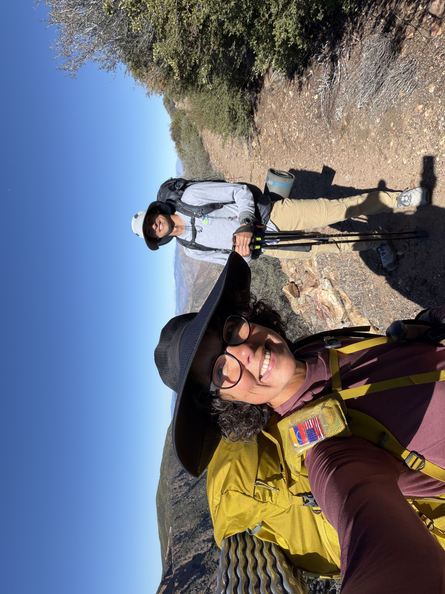
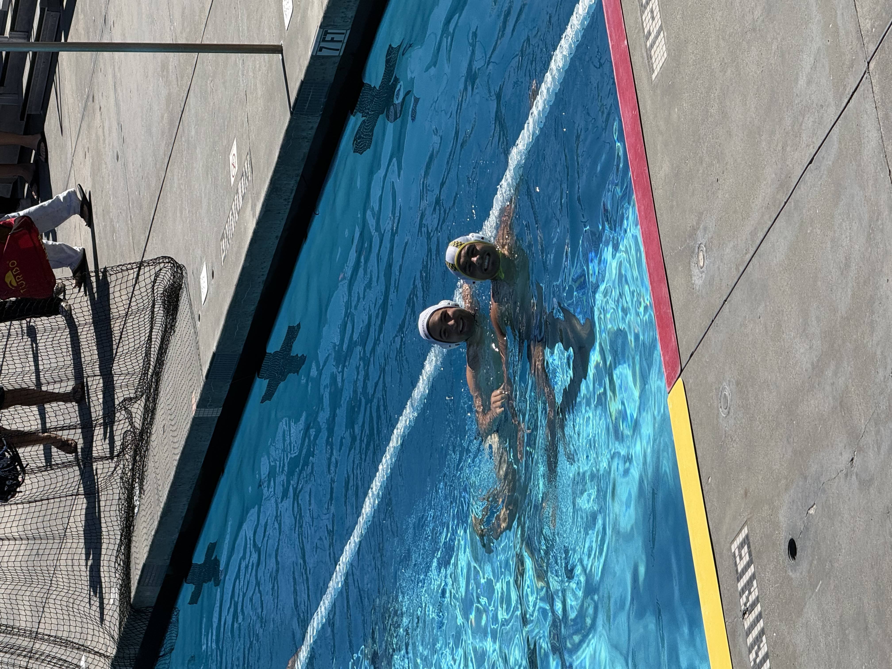
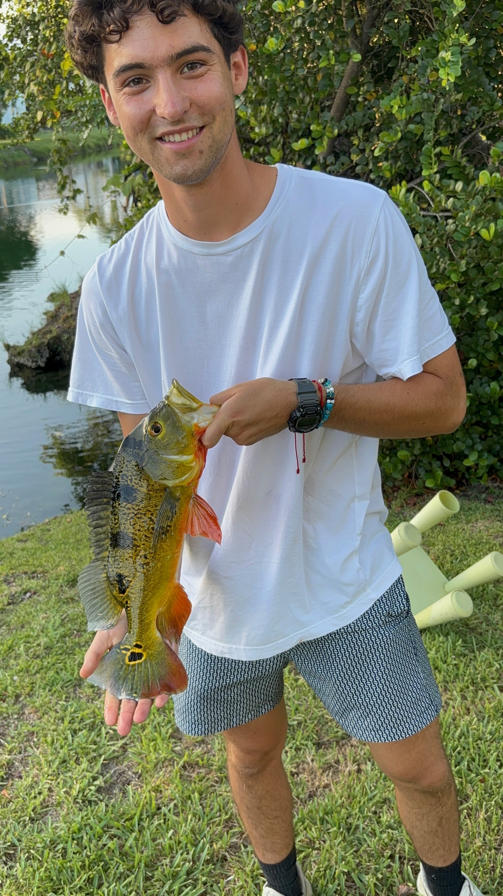

If I have some free time, I am probably playing water polo, scuba diving, surfing, backpacking, or planning my next trip.

## [A few things I enjoy doing]{.underline}

::: {layout="[[1, 1], [1, 1]]"}
{group="Hobbies"}

{group="Hobbies"}

Tidepooling at Devereux Beach in Isla Vista is one of my favorite ways to experience nature. Doing it at night takes things to the next level, and going with my Aquatic Biology roomates turned this into such a fun learning opportunity. Here I spotted a California Two-spot Octopus (*Octopus bimaculoides*) immediately after telling my roomates that the one thing I wanted to find that night was an octopus. (I then proceeded to find another octopus!)

{group="Hobbies"}

Catching non-native Peacock Bass (*Cichla ocellaris*) with my Venezuelan cousins in a backyard freshwater river in Miami, Florida. Visiting my cousins in Florida is always so much fun, and we love going to our hidden little spots that we have been going to for years.
:::
